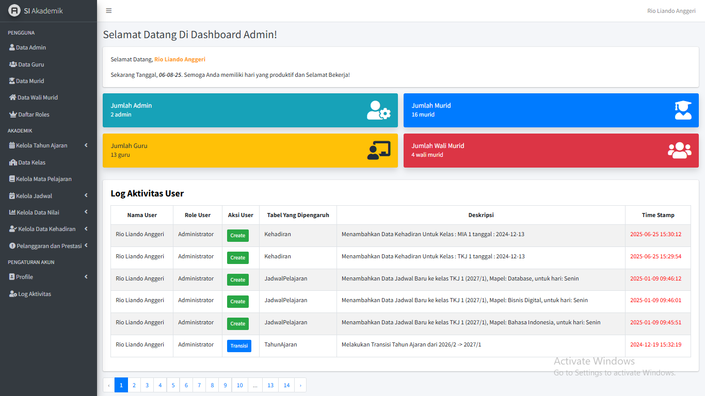
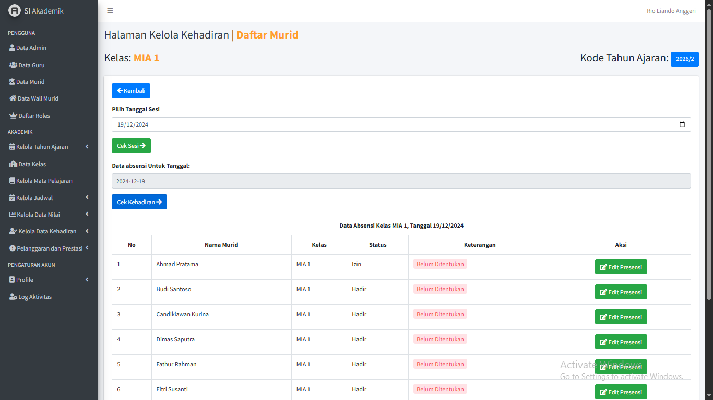

[EN]
# 🎓 Student Evaluation & Monitoring System

  

## 📌 Overview

A web-based system designed to help schools and parents monitor student development comprehensively—from grades and attendance to achievements and violations. This project was developed independently to fulfill the requirements of the Practical Work (Kerja Praktek) course.

## 🚀 Key Features

- Student attendance management
- Grade input and monitoring per semester
- Record of student violations and achievements
- Automatic academic year transition
- User activity log
- Multi-role access: Admin, Teacher, Parent, Student

## 🧰 Tech Stack

- PHP (Laravel)
- MySQL
- Blade Template Engine
- Bootstrap
- jQuery

## 📸 User Interface

| Dashboard | Grade Entry | Attendance |
|----------|-------------|-------------|
|  |  |  |

## 🏁 Project Impact

- Improves transparency between schools and parents.
- Solves the issue of manual student data monitoring.
- Demonstrates full-cycle development capabilities by a single developer.

## 📁 Additional Documentation

To view more interface screenshots, please check the `./screenshots` folder. It contains a complete visual reference of all system features.

---

[ID]
# 🎓 Sistem Informasi Evaluasi dan Pemantauan Murid

  

## 📌 Deskripsi Singkat

Sistem berbasis web yang dirancang untuk membantu sekolah dan wali murid dalam memantau perkembangan siswa secara menyeluruh—mulai dari nilai, kehadiran, prestasi, hingga pelanggaran. Proyek ini dikembangkan secara mandiri dalam rangka memenuhi matakuliah Kerja Praktek.

## 🚀 Fitur Utama

- Manajemen kehadiran siswa
- Entri dan pemantauan nilai semester
- Riwayat pelanggaran dan prestasi
- Transisi tahun ajaran otomatis
- Log aktivitas pengguna
- Multi-role access: Admin, Guru, Wali Murid, Murid

## 🧰 Stack Teknologi

- PHP (Laravel)
- MySQL
- Blade Template Engine
- Bootstrap
- jQuery

## 📸 Tampilan Antarmuka

| Dashboard | Entri Nilai | Kehadiran |
|----------|-------------|-----------|
|  |  |  |

## 🏁 Dampak Proyek

- Meningkatkan transparansi antara sekolah dan wali murid.
- Menyelesaikan masalah manualitas data monitoring siswa.
- Menunjukkan kapabilitas full-cycle development oleh satu developer.

## 📁 Dokumentasi Tambahan

Untuk melihat lebih banyak tampilan antarmuka atau screenshot lainnya, silakan buka folder `./screenshots`. Folder ini berisi dokumentasi visual lengkap dari berbagai fitur yang tersedia dalam sistem

