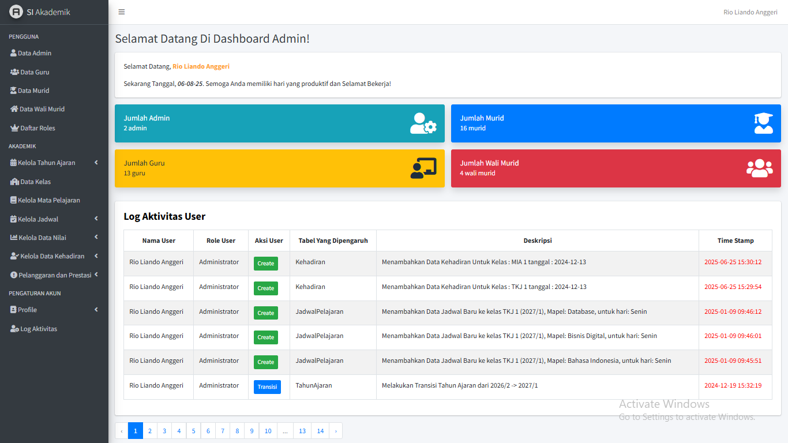
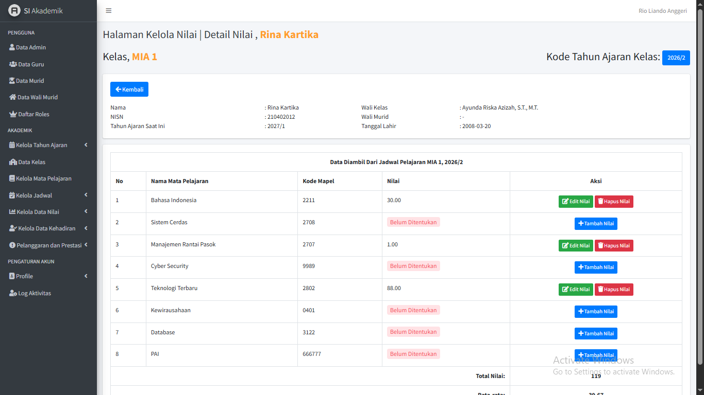
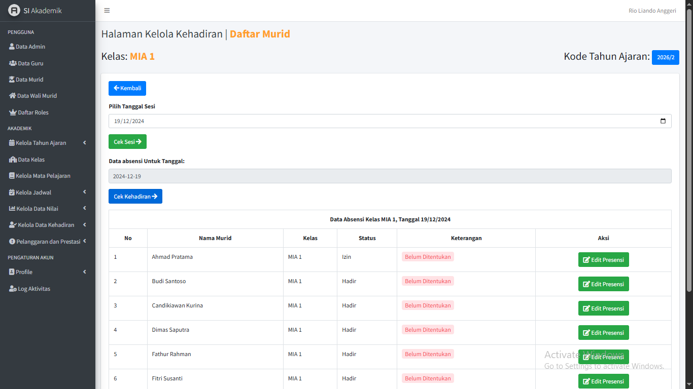

[ID]
# 🎓 Sistem Informasi Evaluasi dan Pemantauan Murid

  

## 📌 Deskripsi Singkat

Sistem berbasis web yang dirancang untuk membantu sekolah dan wali murid dalam memantau perkembangan siswa secara menyeluruh—mulai dari nilai, kehadiran, prestasi, hingga pelanggaran. Proyek ini dikembangkan secara mandiri dalam rangka memenuhi matakuliah Kerja Praktek.

## 🚀 Fitur Utama

- Manajemen kehadiran siswa
- Entri dan pemantauan nilai semester
- Riwayat pelanggaran dan prestasi
- Transisi tahun ajaran otomatis
- Log aktivitas pengguna
- Multi-role access: Admin, Guru, Wali Murid, Murid

## 🧰 Stack Teknologi

- PHP (Laravel)
- MySQL
- Blade Template Engine
- Bootstrap
- jQuery

## 📸 Tampilan Antarmuka

| Dashboard | Entri Nilai | Kehadiran |
|----------|-------------|-----------|
|  |  |  |

## 🏁 Dampak Proyek

- Meningkatkan transparansi antara sekolah dan wali murid.
- Menyelesaikan masalah manualitas data monitoring siswa.
- Menunjukkan kapabilitas full-cycle development oleh satu developer.

## 📁 Dokumentasi Tambahan

Untuk melihat lebih banyak tampilan antarmuka atau screenshot lainnya, silakan buka folder `./screenshots`. Folder ini berisi dokumentasi visual lengkap dari berbagai fitur yang tersedia dalam sistem
